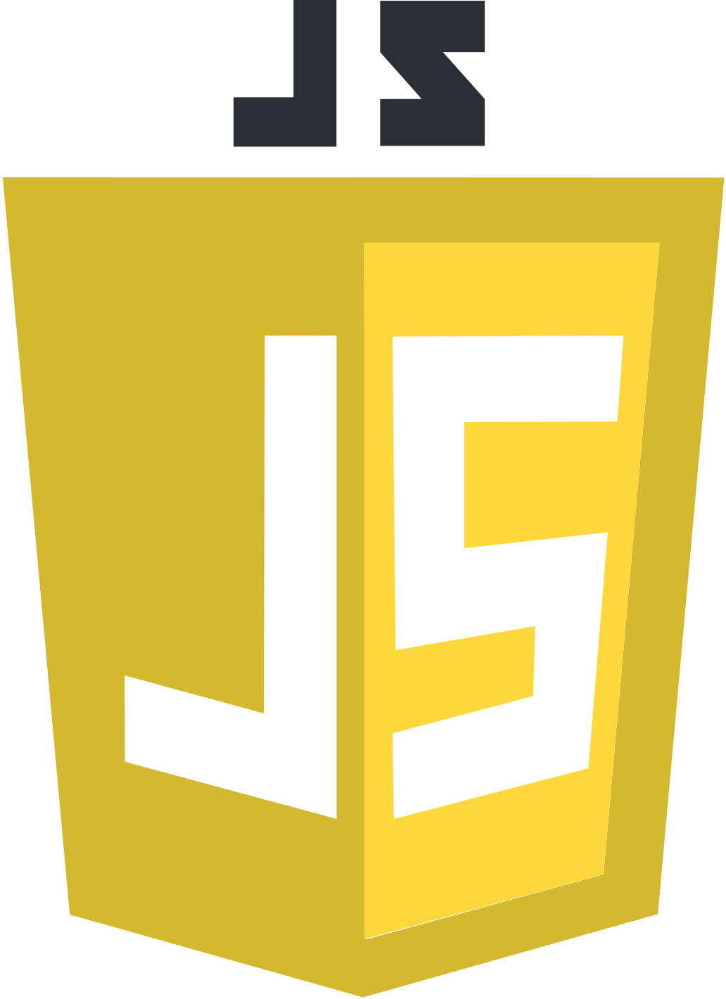

Thunder is a full-stack musical quiz web application. It has been developed for 5 weeks within Wild Code School curriculum during April and May 2020. I was part of a 4-member team and the main challenge for us was to be able to develop this application applying the SCRUM methodology and working full remote, given the coronavirus health crisis. 

The instructions for this 5-week project was to develop a Frontend web app using React.js and relying upon an API. Thunder is a musical quiz based on the Napster API. A user would enter a username, and choose a mode between two choices:

* Standard : 10 questions on a musical genre of his choice (21 possibilities available);
* Survival: unlimited number of questions on random themes.

The user would play the game and at the end of the session he would get his score, be able to share the result on facebook, listen to the tracks and see his ranking. 

However, we felt that the app was missing a more personalized experience : the possibility for the user to save his favorite tracks, to appear in the rankings and store his highest scores. Thus we decided to add a user account feature. We learnt how to set up an authentication system, to create and to maintain a database.



For my team and I, developing a game has been a good way to consolidate our skills in React.js, to self learn Node.js, Express.js and MySQL and more importantly to successfully work full remote applying the SCRUM methodology. 

We were able to build this app with the courtesy of [Napster](https://developer.napster.com/developer).

👉Play [here](https://wild-thunder.netlify.app/) 
👉Check the source code of the Frontend [here](https://github.com/clrko/wild-thunder/) 
👉Check the source code of the Backend [here](https://github.com/clrko/Back_BindTest)