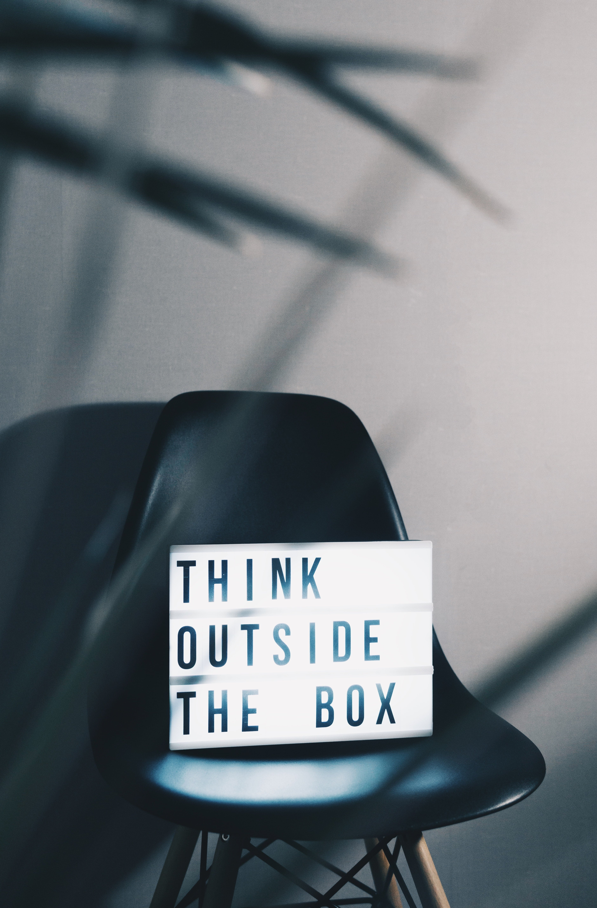

I had not initially planned on writing a full article on this topic. It was supposed to be a small paragraph in the about me page. At first, when I decided to quit my comfy consulting job and take the plunge, my family and close friends would ask me this exact same question : "Are your years working in Finance really lost?"

At this time, I was actually still trying to figure it out. I did not have enough hindsight to find an answer. I would say: "No, they are not! I am just taking an other orientation for the time being and in the long term if and when I start my own company, everything I have learnt from my previous experiences will be useful." Yeah.. I know.. It was probably more of a reassurance than to fully studied plan. 

Anyway, it took me some time to start figuring it out. I had to wait until joining the Wild Code School and meeting people from the programming world though meet ups and web conferences to finally find a first answer. 

>No, definitely not! On the contrary I have learnt so much!

Obviously, I have acquired strong analytical and financial skills. I value teamwork too. However, I needed to actually hear the feedbacks from my teammates from Wild Code School, to realize what my real skills were.

## Communication 

Firstly, in addition to the obvious analytical and financial related skills, who could have thought that I would have developed deep interpersonal skills and a good ability to communicate. Finance professionals need to be able to build successful relationship with customers. It is even more critical if you want to excel in business related positions like when I was working at real estate leasing analyst at HSBC France. In my deal structuring and origination role, I would assist the client from the quotation to the closing with notary.

**What does it mean for you?** It means that I will be able to communicate with the client and understand its needs efficiently. Besides, while coding, I will always keep in mind the business implications behind the project. These skills are not only critical when dealing with clients but also when working with multiple stakeholders in a projet (UX / UI Designers, cost controllers, product manager etc.) to ensure a smooth communication and avoid potential misunderstandings. 

## Innovation

Secondly, I have developed a capacity for innovation. Finance is not about routines and numbers but about providing accurate data to support the lifecycle and development of your business. In this case, when you need to do regular reporting, when you need to share financials to large audience, when you need to ensure the accuracy of your data etc. you need to think and rethink your processes and systems. Sometimes, I would think on a way to automize my work, other times I would think on a new dynamic dashboard to help supporting the decision-making process related to a new business with new data. 

What does it mean for you? It means that in web development I will always try to think out of the box. The digital environment is changing. We need to adapt meaning to be able to innovate and improve. 

## Digital transformation and change management

Thirdly, I have also acquired a good knowledge and proficiency on IT softwares. Over the last years, the finance fonction has been undergoing a digital transformation. I had the chance to be at the heart of this transformation in finance controlling, treasury and accounting. I had the opportunity to work with both the enduser and IT project team. I have learnt a lot on the importance of communication and training, and more globally on change management.

## Decision-making skills

Furthermore, I have developed strong problem-solving and decision-making skills. In the finance industry, especially during my experience in Treasury, I needed to be able to tackle complex problems as they arose either when managing the integration of new acquired entities or when working on the daily treasury management. I have learnt to asses efficiently the financial, compliance and technical implications of any decision to be made. 

What does it mean for you? It means that when working on a project I will not be only focusing on the technical side of things but I will be seeing the bigger picture (for instance, performance, budget etc.). 

I coud say so much more on this topic but it will be quite long for this section. If you want to know more, then contact me! 

Claire 

<a style="background-color:black;color:white;text-decoration:none;padding:4px 6px;font-family:-apple-system, BlinkMacSystemFont, &quot;San Francisco&quot;, &quot;Helvetica Neue&quot;, Helvetica, Ubuntu, Roboto, Noto, &quot;Segoe UI&quot;, Arial, sans-serif;font-size:12px;font-weight:bold;line-height:1.2;display:inline-block;border-radius:3px" href="https://unsplash.com/@goian?utm_medium=referral&amp;utm_campaign=photographer-credit&amp;utm_content=creditBadge" target="_blank" rel="noopener noreferrer" title="Download free do whatever you want high-resolution photos from Ian Schneider"><svg xmlns="http://www.w3.org/2000/svg" style="height:12px;width:auto;position:relative;vertical-align:middle;top:-2px;fill:white" viewBox="0 0 32 32"><title>unsplash-logo</title><path d="M10 9V0h12v9H10zm12 5h10v18H0V14h10v9h12v-9z"></path></svg>Ian Schneider</a>

<a style="background-color:black;color:white;text-decoration:none;padding:4px 6px;font-family:-apple-system, BlinkMacSystemFont, &quot;San Francisco&quot;, &quot;Helvetica Neue&quot;, Helvetica, Ubuntu, Roboto, Noto, &quot;Segoe UI&quot;, Arial, sans-serif;font-size:12px;font-weight:bold;line-height:1.2;display:inline-block;border-radius:3px" href="https://unsplash.com/@chrisliverani?utm_medium=referral&amp;utm_campaign=photographer-credit&amp;utm_content=creditBadge" target="_blank" rel="noopener noreferrer" title="Download free do whatever you want high-resolution photos from Chris Liverani"><svg xmlns="http://www.w3.org/2000/svg" style="height:12px;width:auto;position:relative;vertical-align:middle;top:-2px;fill:white" viewBox="0 0 32 32"><title>unsplash-logo</title><path d="M10 9V0h12v9H10zm12 5h10v18H0V14h10v9h12v-9z"></path></svg>Chris Liverani</a>

<a style="background-color:black;color:white;text-decoration:none;padding:4px 6px;font-family:-apple-system, BlinkMacSystemFont, &quot;San Francisco&quot;, &quot;Helvetica Neue&quot;, Helvetica, Ubuntu, Roboto, Noto, &quot;Segoe UI&quot;, Arial, sans-serif;font-size:12px;font-weight:bold;line-height:1.2;display:inline-block;border-radius:3px" href="https://unsplash.com/@nkachanovskyyy?utm_medium=referral&amp;utm_campaign=photographer-credit&amp;utm_content=creditBadge" target="_blank" rel="noopener noreferrer" title="Download free do whatever you want high-resolution photos from Nikita Kachanovsky"><svg xmlns="http://www.w3.org/2000/svg" style="height:12px;width:auto;position:relative;vertical-align:middle;top:-2px;fill:white" viewBox="0 0 32 32"><title>unsplash-logo</title><path d="M10 9V0h12v9H10zm12 5h10v18H0V14h10v9h12v-9z"></path></svg>Nikita Kachanovsky</a>

<a style="background-color:black;color:white;text-decoration:none;padding:4px 6px;font-family:-apple-system, BlinkMacSystemFont, &quot;San Francisco&quot;, &quot;Helvetica Neue&quot;, Helvetica, Ubuntu, Roboto, Noto, &quot;Segoe UI&quot;, Arial, sans-serif;font-size:12px;font-weight:bold;line-height:1.2;display:inline-block;border-radius:3px" href="https://unsplash.com/@garri?utm_medium=referral&amp;utm_campaign=photographer-credit&amp;utm_content=creditBadge" target="_blank" rel="noopener noreferrer" title="Download free do whatever you want high-resolution photos from Vladislav Babienko"><svg xmlns="http://www.w3.org/2000/svg" style="height:12px;width:auto;position:relative;vertical-align:middle;top:-2px;fill:white" viewBox="0 0 32 32"><title>unsplash-logo</title><path d="M10 9V0h12v9H10zm12 5h10v18H0V14h10v9h12v-9z"></path></svg>Vladislav Babienko</a>

